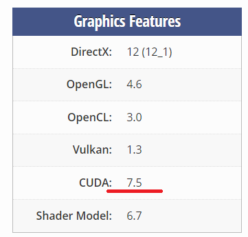
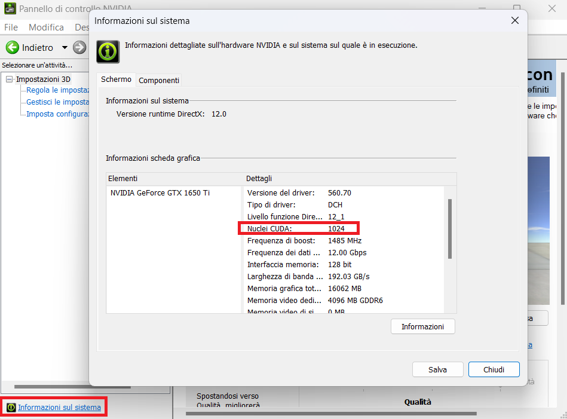
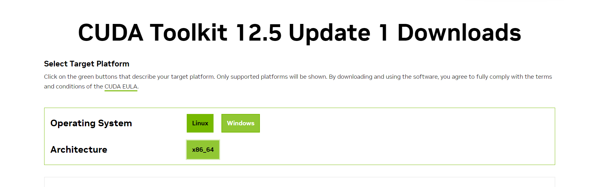

# Machine Learning for classifying Multiple Sclerosis


In this project, I'm using the Pytorch model for classifying images from a kaggle dataset, \
the objective of this project is to create a *POC* (Proof-Of-Concept) system that could help in the diagnosis of a specific neurodegenerative condition like Multiple Sclerosis.\
 The inference will be conducted by a Neural Network\
 From now on, the term `MS` will substitute `Multiple Sclerosis`  
---
### Dataset
The used dataset is downloaded from kaggle: <center>
### [Here](https://www.kaggle.com/datasets/buraktaci/multiple-sclerosis/) </center>

The dataset is composed of 2 type of scans for the 2 type of conditions:
1. Control MRIs (Total Control MRIs: 2016)
2. Multiple Sclerosis MRIs (Total MS MRIs: 1411)

\
For each of these two conditions, the MRIs are divided in:
1. Sagittal MRIs (Total: 774)
2. Axial MRIs (Total: 1652)

### Source of the dataset
This particular dataset was used in the study conducted by 
_Macin, G.; Tasci, B.; Tasci, I.; Faust, O.; Barua, P.D.;
Dogan, S.; Tuncer, T.; Tan, R.-S.; Acharya, U.R._\
_Linked here: [Accurate Multiple Sclerosis Detection Model Based on Exemplar Multiple Parameters Local Phase Quantization: ExMPLPQ. Appl. Sci. 2022, 12, 4920.](https://doi.org/10.3390/app12104920)_


# Tutorial setting up GPU as computing device 
### Requirements: Python3, Python3-supporting IDE, all used libraries.
### 1. Check if your GPU has CUDA cores
First of all, you should check if your GPU has any CUDA cores. You can do this [here](https://www.techpowerup.com/gpu-specs/) checking in `Graphics Features` like:\
\
This is the version of the CUDA drivers that the GPU supports.\

Otherwise you can use NVIDIA Control Panel and check in "System Information":
 

### 2. Install CUDA drivers
If your GPU has CUDA cores, download the installer for the drivers [here](https://developer.nvidia.com/cuda-downloads) selecting the OS and the architecture\
 

### 3. Install Anaconda
Skip registration (or login), select your OS and download and run the installer https://www.anaconda.com/download\


### 4. Creating Conda enviroment
After all this installation, you should check your CUDA-enabled GPU which cuda version does it support [here](https://developer.nvidia.com/cuda-gpus).\
Press Start and open **Anaconda Prompt** and type:
```
conda create --name ENVIROMENT_NAME_GOES_HERE python3=PYTHON3_VERSION_GOES_HERE
```
Afer the creation of the new enviroment you should 
